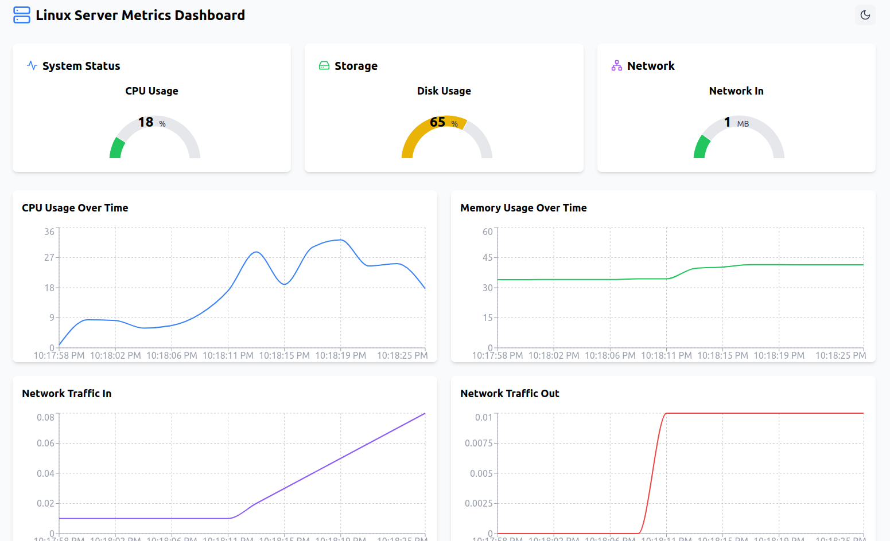

Linux Metrics Application
=========================

This project is a Dockerized application designed to monitor and calculate Linux resource usage. It features a modern frontend built with **Vite.js** for high performance and responsiveness, and a backend powered by **Flask** to handle resource calculations efficiently.

Features
--------

*   **Frontend**: A modern and responsive interface for visualizing system metrics, built with Vite.js.
*   **Backend**: A robust API built with Flask to collect and calculate Linux resource usage.
*   **Customizable Configuration**: The frontend connects to the backend via the file `src/hooks/useMetrics.ts`. You can edit this file to update the backend IP to your server's IP address or use `localhost` if running locally.
*   **Dockerized**: Easily deployable using Docker and Docker Compose for consistent environment setup.

* * *

Prerequisites
-------------

1.  **Install Docker**: [Get Docker](https://docs.docker.com/get-docker/)
2.  **Install Docker Compose**: [Get Docker Compose](https://docs.docker.com/compose/install/)

* * *

Getting Started
---------------

1.  **Clone the repository:**
    
        
        git clone https://github.com/AmirKaseb/docker-linux-resource-app.git
        cd docker-linux-resource-app
                    
    
2.  **Update the frontend configuration:**
    
    Open the file `src/hooks/useMetrics.ts` in the `Frontend/` directory. Modify the `BASE_URL` variable to point to your backend server's IP address. For local testing, use:
    
        
        http://localhost:5000
                    
    
3.  **Navigate to the Docker Compose directory:**
    
        
        cd docker-compose
                    
    
4.  **Start the application using Docker Compose:**
    
        
        docker-compose up -d
                    
    
5.  **Access the application:**
    *   **Frontend**: Open your browser and navigate to `http://localhost`.
    *   **Backend**: The API is accessible at `http://localhost:5000`.

* * *

Project Structure
-----------------

    
    Metrics-Linux/
    ├── Backend/          # Flask backend code and Dockerfile
    ├── Frontend/         # Vite.js frontend code and Dockerfile
    │   ├── src/hooks/useMetrics.ts  # Update backend IP here
    ├── docker-compose/   # Contains docker-compose.yml
    └── README.md         # Project documentation
        

* * *

Images Demo
-----------

### Application 

* * *

Stop the Application
--------------------

To stop the running containers:

    
    docker-compose down
        

* * *

License
-------

This project is licensed under the MIT License. See the `LICENSE` file for details.

* * *

Contributors
------------

*   **Amir Kasseb** ([GitHub Profile](https://github.com/AmirKaseb))